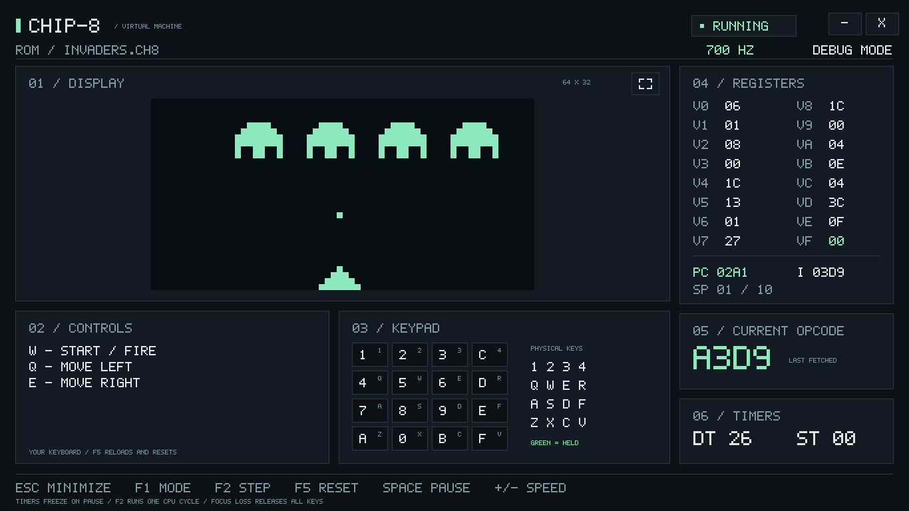
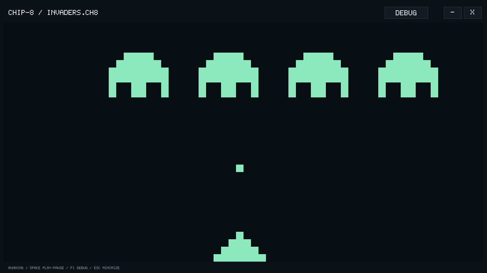
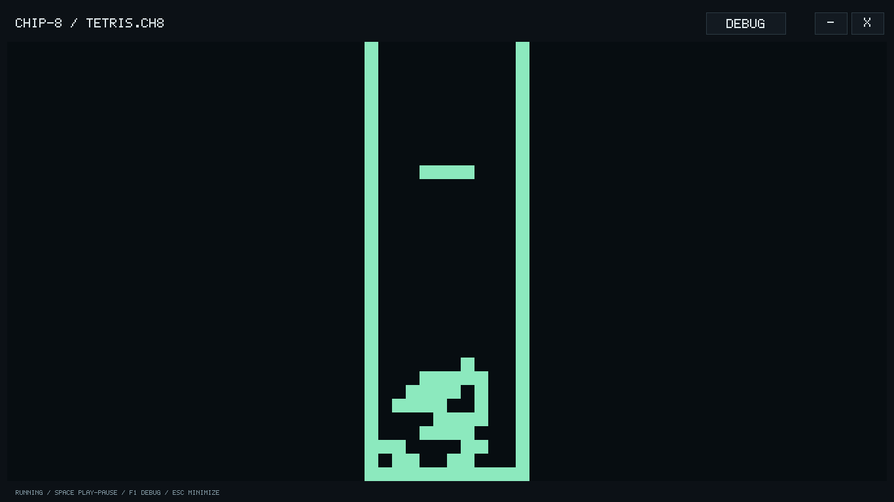
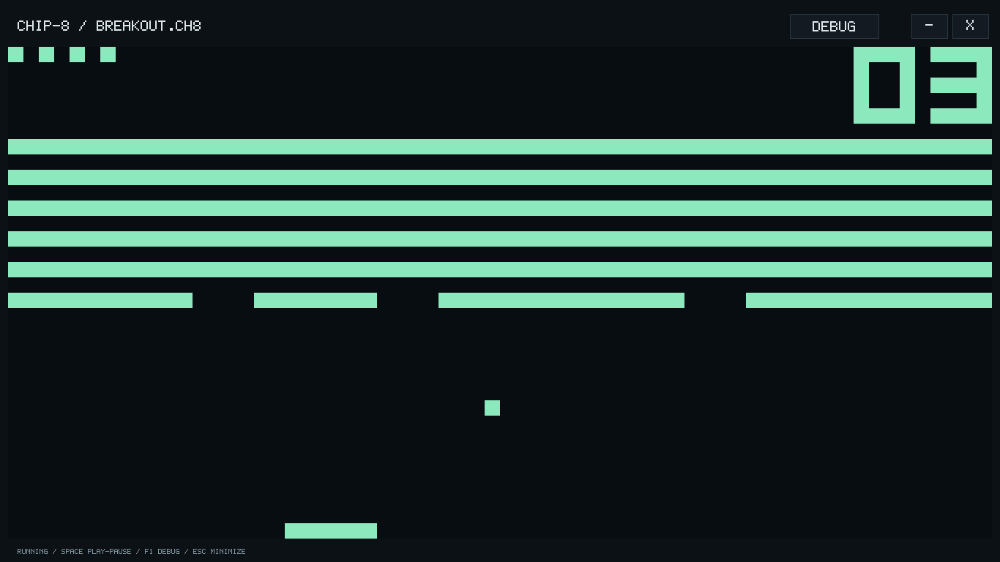
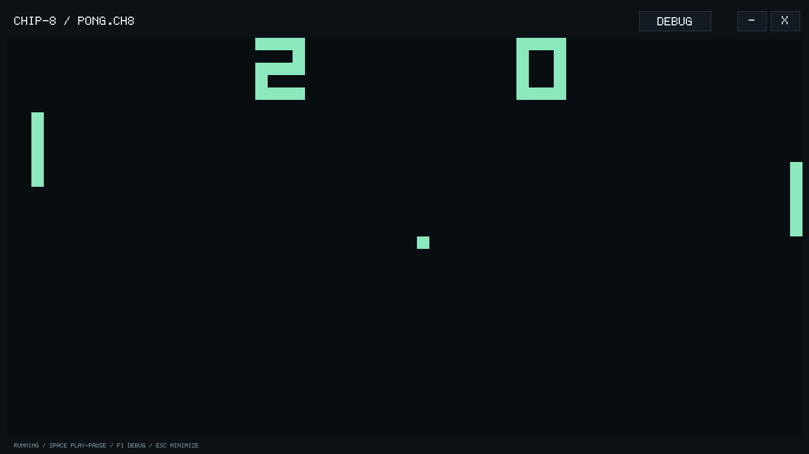

# CHIP-8 Emulator

A **C++17 / SFML 3** desktop emulator for classic CHIP-8 games, with a pixel display, sound, and a live CPU debugger.

## Contributors

| Contributor | Core contributions |
| --- | --- |
| **[Awais](https://github.com/awaiskamil-dev)** | Initialization, arithmetic and logic, sprite drawing, and keypad handling — [Chip8.cpp](src/Chip8.cpp). |
| **[Mustafa](https://github.com/mmkhawaja2006titan)** | Fetch-decode-execute cycle, flow control, random numbers, ROM loading, memory instructions, and timers — [execution](src/Chip8Execution.cpp), [memory](src/Chip8Memory.cpp), [timers](src/Chip8Timers.cpp). |

Contributions follow the authorship comments in the source files.

[**Project report (PDF)**](docs/project-report.pdf) · Architecture, opcode implementation, execution walkthroughs, and design notes.



## Features

- **Play and Debug modes:** switch views without restarting the game.
- **Live CPU state:** registers, program counter, index register, stack pointer, opcode, and timers.
- **Execution controls:** pause, single-step, reset, and adjustable CPU speed from 100 to 2,000 Hz.
- **Crisp graphics and sound:** 64 × 32 display with integer scaling, a built-in pixel font, and a buzzer.
- **32 games and demos:** game-specific controls, a live keypad, and automatic pause on focus loss.

## Screenshots

| Space Invaders | Tetris |
| :---: | :---: |
|  |  |
| **Breakout** | **Pong** |
|  |  |

Real gameplay frames captured through the emulator's SFML renderer at 1366 × 768.

## Build and run

**Requirements:** Windows, a C++17 compiler, SFML **3** (Graphics, Window, System, Audio), and an OpenGL-capable graphics driver. Use matching compiler and SFML builds; SFML 2 is not supported.

From the repository root in PowerShell, using MSYS2 / MinGW-w64:

```powershell
# Adjust to your MSYS2 installation.
$env:Path = "C:\msys64\mingw64\bin;$env:Path"
New-Item -ItemType Directory -Force build | Out-Null

g++ -std=c++17 -Wall -Wextra -Wpedantic src/*.cpp -o build/chip8.exe -lsfml-graphics -lsfml-window -lsfml-system -lsfml-audio
./build/chip8.exe "roms/Invaders.ch8"
```

**Press Space to run, then W to start Space Invaders.** All ROMs start paused.

```powershell
./build/chip8.exe "roms/Tetris.ch8"
./build/chip8.exe "roms/Pong.ch8" --debug
./build/chip8.exe "roms/Breakout.ch8" --hz 900
./build/chip8.exe --help
```

Launch without a ROM to open an empty debugger. CPU speed defaults to **700 Hz**; timers run independently at **60 Hz**.

<details>
<summary>Build with CMake / run tests</summary>

Requires CMake 3.16+ and the same MinGW/SFML toolchain on `PATH`:

```powershell
cmake -S . -B build/cmake -G "MinGW Makefiles" -DCMAKE_PREFIX_PATH=C:/msys64/mingw64 -DCHIP8_BUILD_TESTS=ON
cmake --build build/cmake
./build/cmake/chip8.exe "roms/Invaders.ch8"
ctest --test-dir build/cmake --output-on-failure
```

The integration suite checks input, timing, pause/step/reset, control guides, and rendering. Rendering tests require OpenGL; deliberate core-error messages are expected in error-handling checks.

</details>

## Controls

| Key | Action |
| --- | --- |
| **F1** | Switch Play / Debug mode |
| **Space** | Pause / resume |
| **F2** | Step one CPU cycle while paused |
| **F5** | Reload and reset the game |
| **+ / −** | Adjust CPU speed by 100 Hz (`=` also increases speed) |
| **Esc** | Minimize the window |

```text
Your keyboard          CHIP-8 keypad
  1 2 3 4                1 2 3 C
  Q W E R                4 5 6 D
  A S D F                7 8 9 E
  Z X C V                A 0 B F
```

| Game | Keyboard controls |
| --- | --- |
| Space Invaders | **W** start/fire · **Q / E** left/right |
| Tetris | **Q** rotate · **W / E** left/right · hold **A** to drop faster |
| Breakout | **Q / E** move paddle left/right |
| Pong | **1 / Q** left paddle up/down · **4 / R** right paddle up/down |

Other games show their controls in Debug mode. To add a guide for `roms/Game.ch8`, create `controls/Game.txt` with up to six short ASCII lines (35 characters each). Lines starting with `#` are comments. Guides describe controls without remapping keys; **F5** reloads the guide and resets the game.

## Notes

- The frontend uses a fixed **1366 × 768** borderless Windows layout.
- Keep the SFML and compiler runtime DLLs on `PATH`; the `.exe` alone is not a standalone distribution.
- Pausing or losing focus freezes execution and silences audio. Unsupported opcodes stop the core and report an error in the terminal.
- Targets classic CHIP-8; full Super-CHIP and XO-CHIP extensions are not implemented. ROM compatibility varies.

ROMs come from [netpro2k/Chip8](https://github.com/netpro2k/Chip8/tree/master/games). See [ROM attribution](docs/rom-attribution.md) for authors, hashes, and distribution notes. The collection contains 33 files, including a duplicate Tetris ROM.
